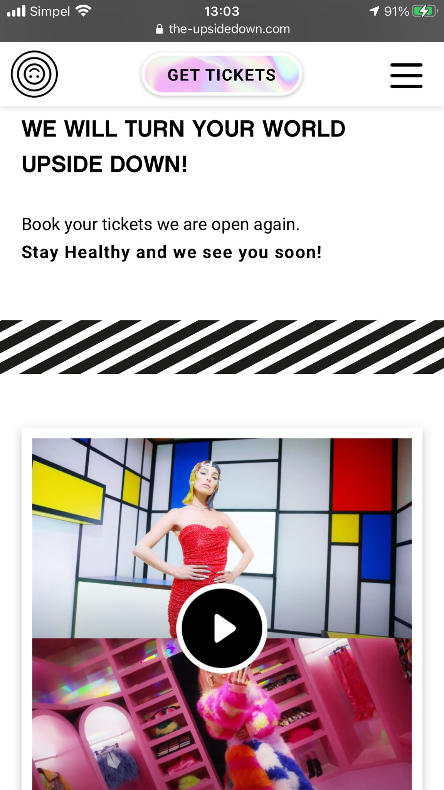
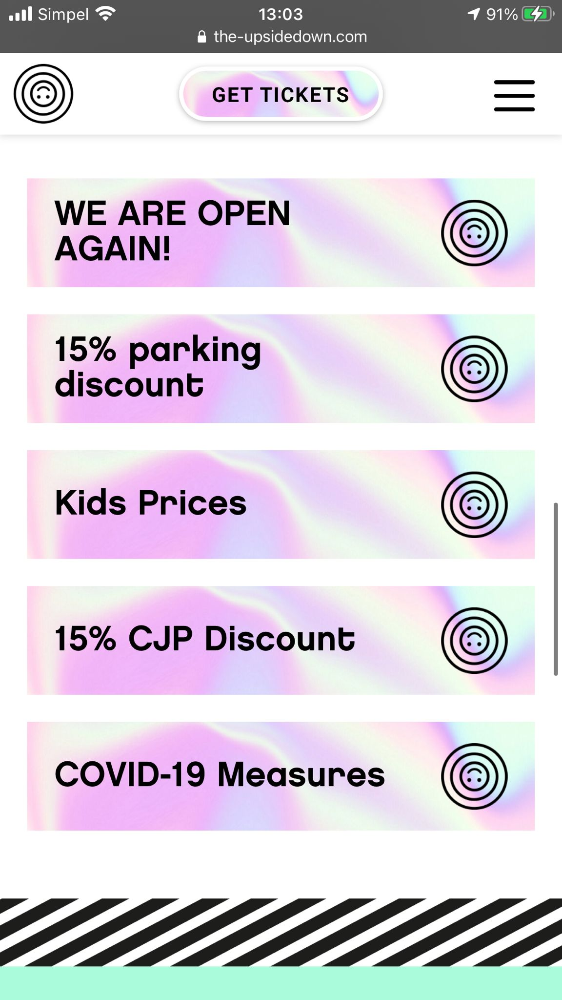
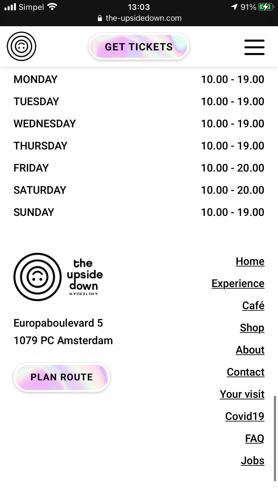
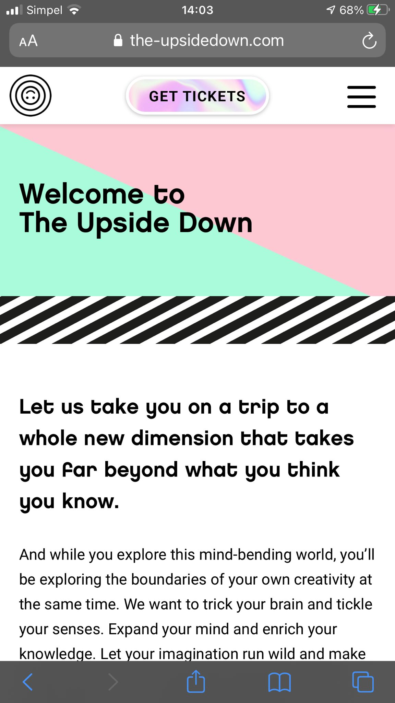
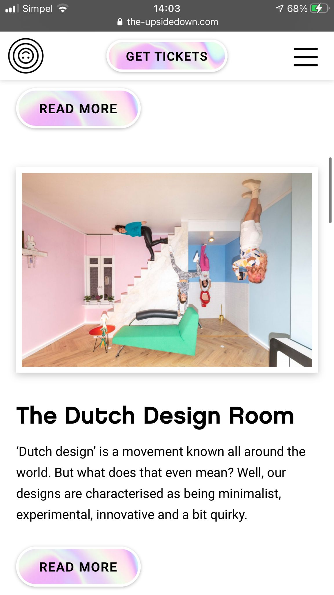
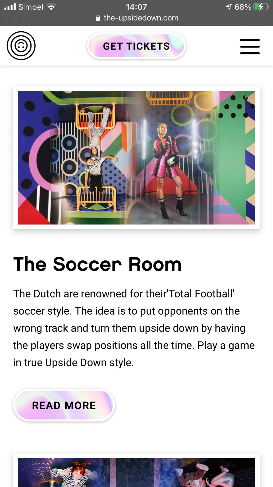
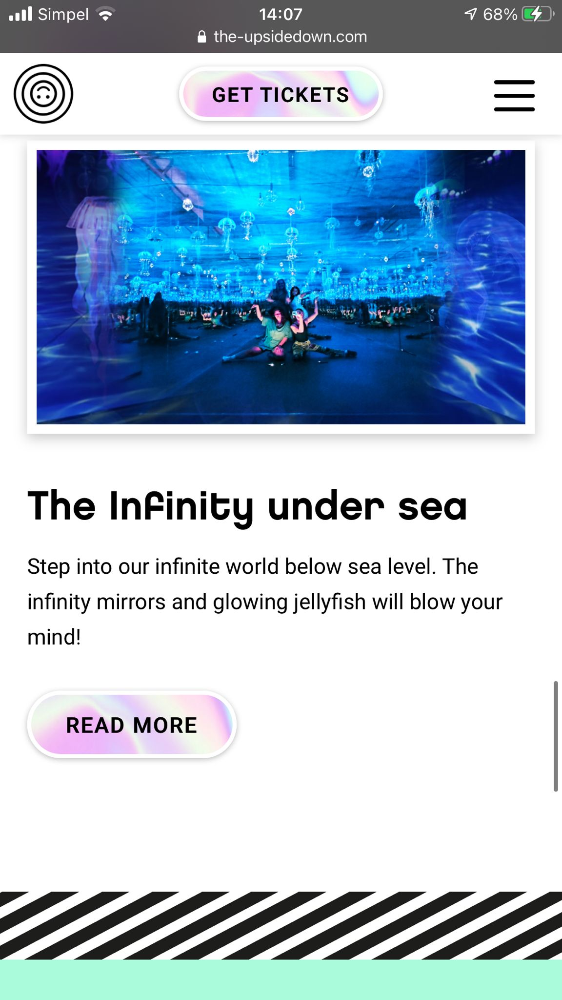
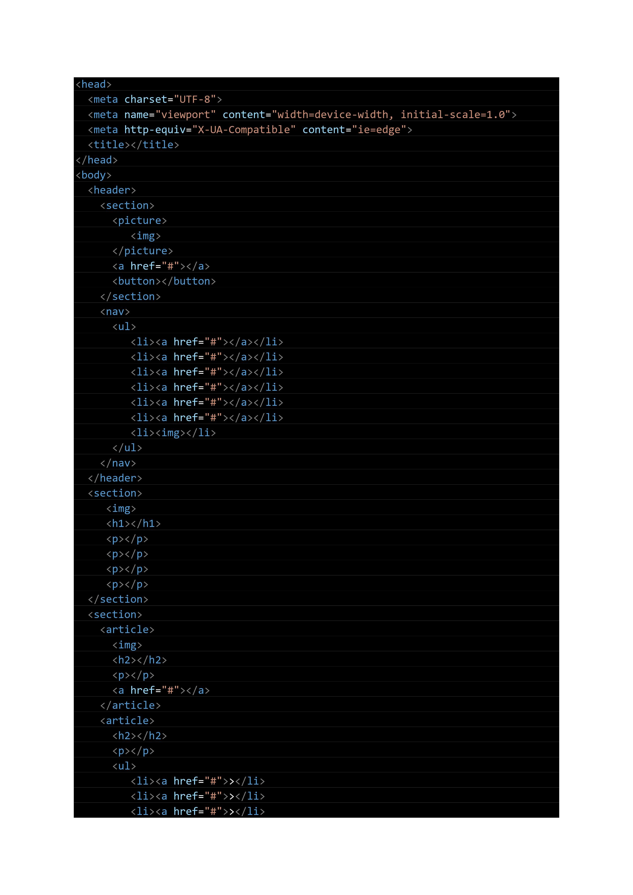
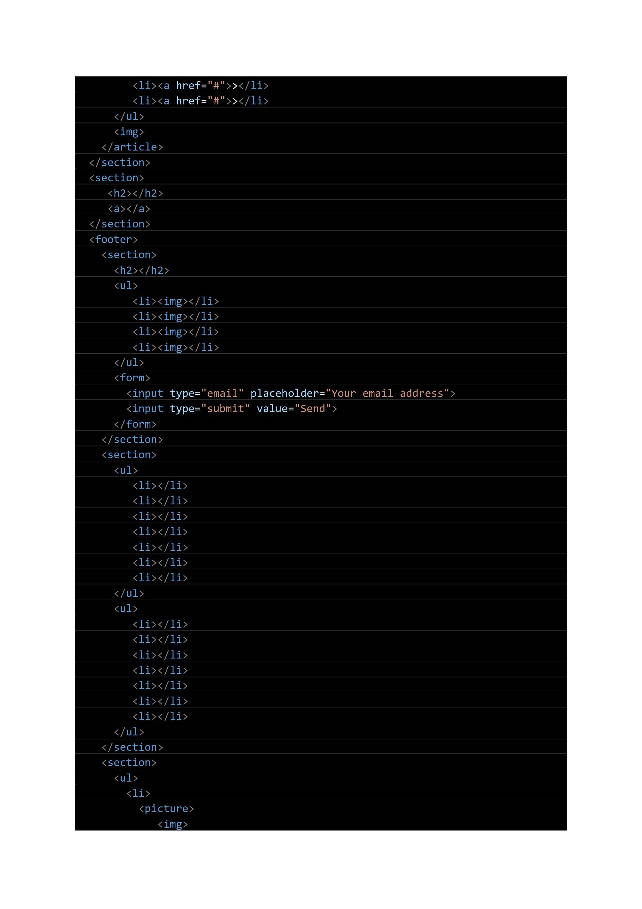
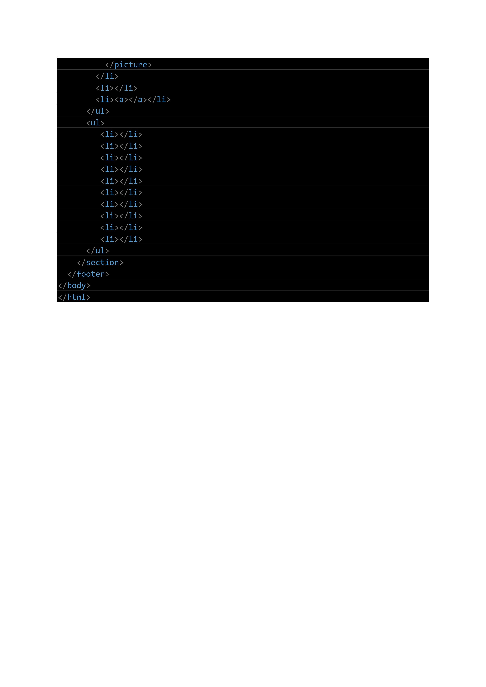

# Procesverslag
Markdown is een simpele manier om HTML te schrijven.  
Markdown cheat cheet: [Hulp bij het schrijven van Markdown](https://github.com/adam-p/markdown-here/wiki/Markdown-Cheatsheet).

Nb. De standaardstructuur en de spartaanse opmaak van de README.md zijn helemaal prima. Het gaat om de inhoud van je procesverslag. Besteedt de tijd voor pracht en praal aan je website.

Nb. Door *open* toe te voegen aan een *details* element kun je deze standaard open zetten. Fijn om dat steeds voor de relevante stuk(ken) te doen.

## Jij

uitwerken voor kick-off werkgroep

### Auteur:
Salomé de Ruiter (vervangen door jouw naam)

#### Je startniveau:
Blauw (kies uit zwart, rood óf blauw)

#### Je focus:
Surface plane (kies uit responsive óf surface plane)

## Je website

uitwerken voor kick-off werkgroep

### Je opdracht:
https://the-upsidedown.com/

#### Screenshot(s) van de eerste pagina (small screen):
Homepagina

#### Screenshot(s) van de tweede pagina (small screen):
Experience pagina

## Breakdownschets (week 1)

uitwerken na afloop 2e werkgroep

### de hele pagina:

### dynamisch deel (bijv menu):

Nav element met daarin een unordered list met list items, met daarin a elementen (linkjes) en onderin een image.
<nav>
      <ul>
        <li></li>
        <li></li>
        <li></li>
        <li></li>
        <li></li>
        <li></button></li>        
        <li></li>
      </ul>

## Voortgang 1 (week 4)

uitwerken voor 1e voortgang

### Stand van zaken
hier dit ging goed & dit was lastig (neem ook screenshots op van delen van je website en code)

Wat ging goed: HTML van de pagina's, koppelen CSS en makkelijke dingen stylen.
Wat was lastig: Sommige elementen de goede breedte geven, beginnen met javascript voor het uitschuif menu.

### Agenda voor meeting
samen met je groepje opstellen

Tips om te beginnen met CSS en wat doe ik fout bij mijn javascript code. Verder of mijn html volgens de regels is.

### Verslag van meeting
hier na afloop snel de uitkomsten van de meeting vastleggen

- Html sommige h1 en p's in ul en li's zetten
- Geholpen met javascript
- Op weg geholpen met CSS -> flex, keyframes gebruiken

## Voortgang 2 (week 8)

uitwerken voor 2e voortgang

### Stand van zaken
hier dit ging goed & dit was lastig (neem ook screenshots op van delen van je website en code)

Wat ging goed: beide pagina's stylen en zelfs paar dingen voor de surface plane
Wat was lastig: alle eisen voor de surface plane opdracht op orde krijgen

### Agenda voor meeting
Laten zien wat ik heb en vragen naar dingen om verder nog uit te werken voor de surface plane die van toepassing zijn op mijn website.

### Verslag van meeting
hier na afloop snel de uitkomsten van de meeting vastleggen

- toggle voor de dark mode maken
- extra keyframes toevoegen voor interactie
- transition toevoegen

## Eindgesprek (week 5)

uitwerken voor eindgesprek

### Stand van zaken
hier dit ging goed & dit was lastig (neem ook screenshots op van delen van je website en code)

### Screenshot(s)

hier screenshot(s) van je eindresultaat

## Bronnenlijst

continu bijhouden terwijl je werkt

Nb. Wees specifiek ('css-tricks' als bron is bijv. niet specifiek genoeg).

1. bron 1
2. bron 2
3. ...

